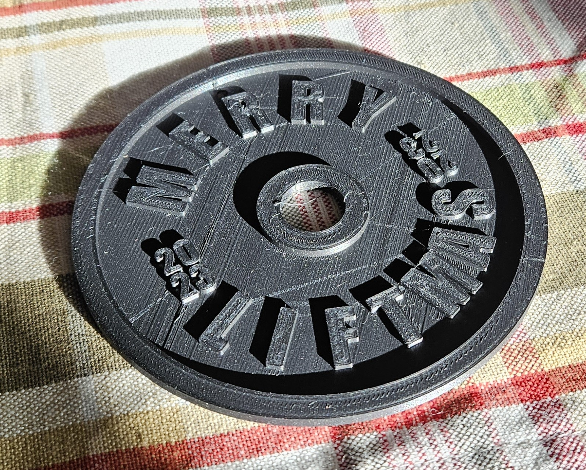

# "Merry Liftmas" Christmas Ornament :christmas_tree::weight_lifting:
---
# How to use
The model was created in OpenSCAD. The model is mostly parameterized, but you'll likely need to do some tweaking if you want to, for example, change the font. The `text_on.scad` module was borrowed from https://github.com/brodykenrick/text_on_OpenSCAD

# Tips for printing
Because there is detail on both sides of the ornament I have chosen to print the model in two halves and then glue it together afterwards. To do this, just position the model in the slicer halfway below the build plate, which will cause it to print only the top half. Print two, line up the hanging hole, and then glue them together,.

Also, it looks nice when the printing is colored white, so you can either paint it or setup the slicer to pause the print at the right layer so you can switch to white. After the letters finish printing you might then want to switch back to black to finish up the outer rim in black.

